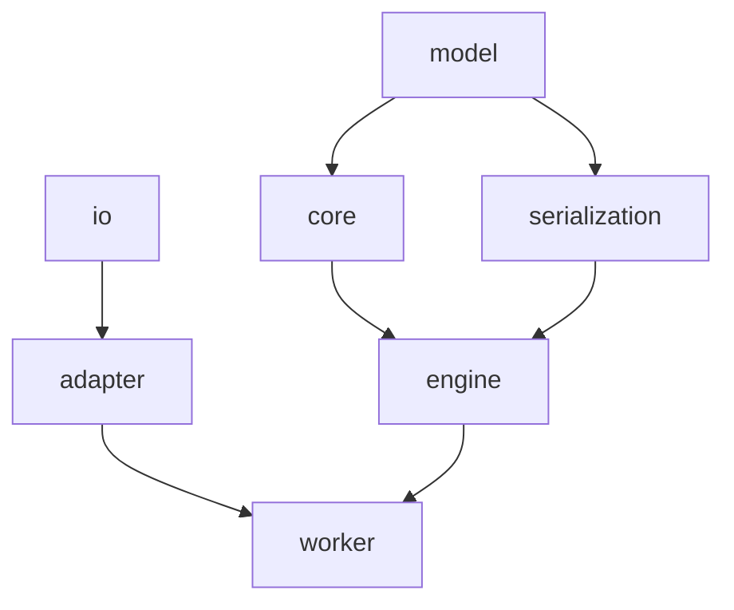
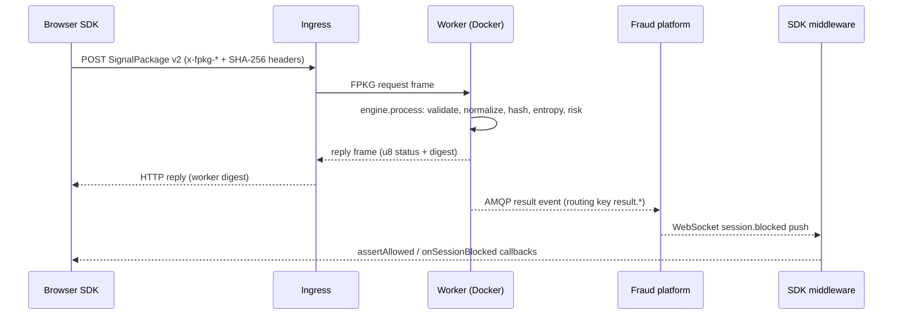

# Architecture Overview

## Design Principle

The Fingerprint Engine is a **deterministic computation engine**. It is not
a service: it knows nothing about transport, queues, databases,
authentication, or business logic. Every module depends **inward**:



`model` depends on nothing. `core` and `serialization` depend on `model`;
`engine` depends on `core` and `serialization`. `io` depends on nothing;
`adapter` depends on `io`; `worker` depends on `engine` and `adapter`. There
are no circular imports, no global mutable state, and no hidden allocations
in the core algorithms.

## Layer 1: Model (`src/model/`)

The runtime data model — feature definitions, the compile-time registry, and
the fingerprint value types. Depends on nothing.

```
src/model/
├── feature.zig        # FeatureType, FeatureDefinition
├── definitions.zig    # 102 FeatureIDs with types and weights across 21 categories
├── registry.zig       # Compile-time feature registry
├── value.zig          # FeatureValue tagged union
├── feature_binding.zig # Feature (id + value)
├── metadata.zig       # FingerprintMetadata
├── fingerprint.zig    # Fingerprint
└── root.zig           # Public facade
```

## Layer 2: Core (`src/core/`)

Deterministic algorithms only — same input, same output, any platform.

```
src/core/
├── hashing/           # SHA-256: feature, fingerprint, incremental hasher
├── normalization/     # Type + bounds validation
├── validation/        # Required-feature checking
├── similarity/        # Feature-level and weighted fingerprint scoring
├── entropy/           # Shannon entropy
├── risk/              # Risk scoring and flagging
└── root.zig           # Public facade
```

## Layer 2: Serialization (`src/serialization/`)

Versioned binary and JSON codecs for the model (schema v2 body + v1 compat).

```
src/serialization/
├── binary.zig         # Versioned TLV ("FNGR" magic, v2 body, v1 compat)
├── json.zig           # Human-readable JSON
├── codec.zig          # Comptime CodecID/Codec interface
├── integrity.zig      # SHA-256 payload integrity helpers
└── root.zig
```

## Layer 3: Engine (`src/engine/`)

The deterministic computation boundary. Versioned `Operation`/`Status`/
`CodecID`, immutable `Request`, caller-owned `Response`, and `process()`
with a comptime dispatch table plus per-op handlers (`validate`, `normalize`,
`serialize`, `deserialize`, `hash`, `entropy`, `similarity`, `risk`,
`package`). The engine imports no io/transport code.

## Layer 4: IO, Adapters, Worker

```
src/io/                # Transport-independent async primitives (no deps)
├── message.zig        # Arena-backed Message / MessagePool
├── ring_buffer.zig    # Bounded FIFO
├── channel.zig        # Typed Channel
├── completion.zig     # Embedded Completion
├── executor.zig       # Deterministic single-threaded Executor
├── frame.zig          # FPKG Frame envelope
├── reader.zig         # Fixed-buffer Reader
├── writer.zig         # Fixed-buffer Writer
├── dispatcher.zig     # Comptime Dispatcher
└── root.zig

src/adapter/           # Transport implementations (depend on io only)
├── transport.zig      # Comptime transport.check + FPKG framing helpers
├── loopback.zig       # In-memory queues / stdin-stdout pipes
├── tcp.zig            # FPKG request/response server
└── amqp/              # AMQP 0-9-1 client, protocol, types, result publisher

src/worker/            # Deterministic worker executable
└── main.zig           # CLI: start --transport=loopback|tcp, --publish=none|amqp
```

The worker is a thin shell: receive FPKG frame → deserialize → `engine.process()`
→ serialize → reply (and optionally publish result events to AMQP). It ships
as a Docker container (`deploy/Dockerfile.worker`); there is **no native SDK
and no C ABI**.

## Layer 5: Browser SDK (`src/clients/browser/`)

Hand-written TypeScript SDK. The browser **never computes the canonical
fingerprint**: collectors emit plain `Signal[]`, `package.ts` serializes a
versioned SignalPackage v2 body (mirroring `serialization/binary.zig`
byte-for-byte), and `transport.ts` POSTs it to the ingress with `x-fpkg-*`
headers plus a SHA-256 integrity header. `middleware.ts` surfaces the fraud
platform's blocking decisions (`assertAllowed()`/`onSessionBlocked()`).

```
src/clients/browser/
├── src/               # index.ts, types.ts, package.ts, transport.ts, middleware.ts, collectors/
│   └── generated/     # tables.ts + config.ts — generated by zig, single source of truth
├── dist/              # generated by `zig build clients:browser` (tsc + surface guard)
├── README.md          # npm package readme
├── package.json       # npm metadata; ESM only
└── tsconfig.json
```

`zig build clients:browser` derives `FeatureID`/`FeatureType` from the Zig
model (single source of truth), injects the package version and ingress URL
(`--ingress-url` option → `FINGERPRINT_INGRESS_URL` env → built-in default),
runs `tsc`, then verifies the dist surface (no wasm, no fingerprint compute).

The WebAssembly module at `src/wasm.zig` is an infra artifact only — it
serves the benchmark harness and wasmtime test containers. It is **not**
shipped in the npm package.

## Event Flow



Workers run the same deterministic engine as stateless, replayable
computation. The canonical fingerprint is produced only server-side.

## Binary Format

The SignalPackage v2 body uses a versioned TLV (Type-Length-Value) encoding,
little-endian throughout:

```
┌───────────────────────────────────────────────────────────────┐
│ Magic: "FNGR" (4 bytes)                                       │
│ Schema Version: u16 = 2                                       │
│ SDK Version Length: u16 | SDK Version: bytes                 │
│ Collected At: i64 (ms epoch)                                  │
│ Package ID: [16]u8 (replay identity)                          │
│ Feature Count: u16                                            │
│ Features:                                                     │
│   ┌─────────────────────────────────────────────────────────┐ │
│   │ FeatureID: u16 | Type: u8 | Payload Length: u32 | Payload│ │
│   └─────────────────────────────────────────────────────────┘ │
│   ... (repeated)                                              │
└───────────────────────────────────────────────────────────────┘
```

Payloads are shaped by FeatureType: Boolean `u8` 0/1; Integer `i64`;
Float `u64` bitcast; String/Bytes `u32 len + bytes`; arrays `u32 count +
elements`. Unknown schema versions map to `unsupported_version` at the
engine boundary.

## Hashing Algorithm

Fingerprint hashing follows these steps:

1. **Hash metadata**: Schema version + SDK version + collection timestamp
2. **Sort features**: By FeatureID (deterministic order)
3. **Hash each feature**: Type tag + feature ID + value hash
4. **Combine**: Concatenate all hashes and compute final SHA-256

```zig
// Pseudocode
hash = SHA256()
hash.update(schema_version)
hash.update(sdk_version)
hash.update(collected_at)

for feature in sorted(features):
    hash.update(feature.id)
    hash.update(type_tag)
    hash.update(value_hash(feature.value))

return hash.final()
```

## Memory Management

### Zero-Allocation Paths

- Feature construction
- Single feature hashing
- Fingerprint digest computation
- Entropy calculation

### Allocator-Required Paths

- Binary/JSON serialization (uses ArrayList)
- Normalization (returns warning slices)
- Decoding (allocates feature arrays)

### Safety Patterns

```zig
// Error cleanup
const features = try allocator.alloc(Feature, count);
errdefer allocator.free(features);

// Deferred cleanup
defer {
    for (features) |f| freeFeatureValue(allocator, f.value);
    allocator.free(features);
}
```

## Concurrency Model

The core engine is single-threaded and deterministic:

- No global state
- No locks or atomics
- Thread safety via separate engine instances
- The async `Executor` lives at the transport boundary only — the core stays
  synchronous and deterministic

## Testing Strategy

### Unit Tests

- 376 unit tests across `tests/{model,core,serialization,engine,io,adapter,worker,build}/`
- Self-verifying registry (`tests/root.zig`) — `SNAP_UPDATE=1` regenerates the
  import list when it drifts
- `zig build test -- <filter>` runs only matching unit tests

### Integration / E2E Tests

- 6 integration/e2e tests in `src/integration_tests.zig` — the test binary
  contains no engine code and drives pre-built executables as subprocesses
  (`zig build test-integration`)
- Worker e2e tests speak the FPKG wire protocol directly (loopback pipe and
  tcp request/response), pinning the fixture digest as a compile-time constant
- TS SDK parity tests cross-check the TS serializer against the Zig golden
  fixture (`node --test`, the documented Node exception)

### Fuzz Tests

- `tests/fuzz/` — binary decode, normalization, hashing determinism (3 targets)

### Test Data

- Real browser fingerprints (Chrome, Firefox) in `tests/data/fingerprints/`
- Similarity matrix with expected scores in `tests/fixtures/`
- Golden signal-package-v2 fixture + signals manifest in `tests/fixtures/`
