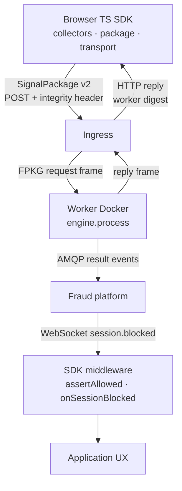
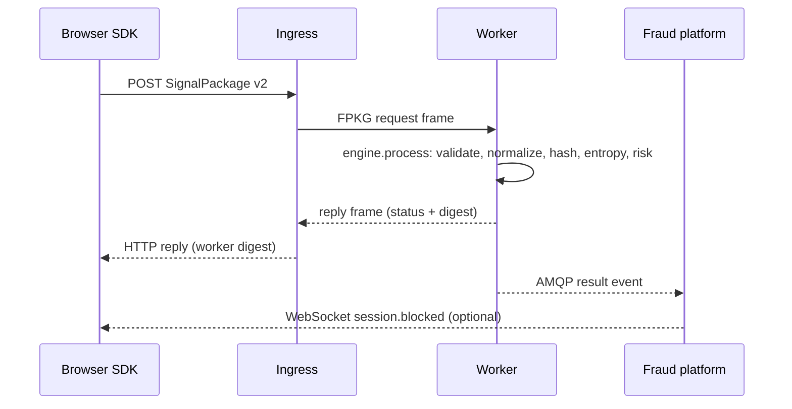

# Fingerprint Engine

**Deterministic, distributed fingerprint computation** — 102 signals · SHA-256 · similarity · risk & entropy · zero dependencies

Written in [Zig 0.14.1](https://ziglang.org) with zero external dependencies.
A reusable deterministic computation engine: the browser collects signals and
ships them as a versioned `SignalPackage`; stateless Zig workers (Docker
containers) compute the canonical fingerprint. The engine knows nothing about
transport, queues, or databases — adapters live outside it.

---

## ✨ Features

| Capability | Details |
| ----------- | --------- |
| **Signals** | **102** browser features across 21 categories |
| **Hashing** | Deterministic SHA-256 — same input, same digest |
| **Binary** | Versioned TLV format (`"FNGR"` magic, schema v2) |
| **JSON** | Pretty-printed with registry name keys |
| **Normalization** | Type validation + bounds checking + warnings |
| **Similarity** | Feature-level (0–1) and fingerprint-level weighted scoring |
| **Entropy** | Shannon entropy — per-signal and aggregate bits |
| **Risk** | Multi-factor risk assessment (low/medium/high/critical) |
| **Engine** | Versioned `Operation`/`Status`, immutable `Request`, comptime dispatch |
| **IO** | Arena `Message`, `RingBuffer`, typed `Channel`, `Executor`, FPKG `Frame` |
| **Worker** | `--transport=loopback\|tcp`, `--publish=none\|amqp`, Docker image |
| **Tests** | **382 passing** · unit + integration/e2e · 3 fuzz targets · 12 benchmarks |

---

## 🚀 Quick Start

### Browser (TypeScript SDK)

The SDK never computes a fingerprint — it collects signals, serializes a
versioned `SignalPackage`, and POSTs it to the ingress:

```typescript
import { configure, collect } from '@akshay2642005/fingerprint-sdk';

configure({ ingressUrl: 'https://ingress.example.com/v1/fingerprints' });

const result = await collect();
console.log('package id:', result.packageId); // replay identity
console.log('signals:   ', result.signalCount);
console.log('sent:      ', result.sent);        // ingress accepted (HTTP 2xx)
console.log('reply:     ', result.reply);       // worker digest, when relayed
```

As fraud-platform middleware (the app remains the authority):

```typescript
import { onSessionBlocked, assertAllowed } from '@akshay2642005/fingerprint-sdk';

onSessionBlocked((decision) => {
  if (decision.reason) UI.notify(`Session blocked: ${decision.reason}`);
});

if (assertAllowed().blocked) {
  return; // do not proceed — last-known decision
}
```

### Engine (Zig)

```zig
const engine = @import("engine");

// Build a request for the hash operation over a signal package.
var response = try engine.process(allocator, &request);
// response.payload is the canonical digest — same bytes on every platform.
```

---

## 📐 Architecture





**Everything depends inward.** `model` depends on nothing; `core` and
`serialization` depend on `model`; `engine` depends on `core` + `serialization`;
`io` → `adapter` → `worker`. The core is pure deterministic computation — no
HTTP, no queues, no databases, no business logic. The canonical fingerprint is
computed **only** by the workers; there is no native SDK and no C ABI.

---

## 📊 Stats

| Metric | Value |
| -------- | ------- |
| Browser signals | **102** across 21 categories |
| Tests | **382** (376 unit + 6 integration/e2e, all passing) |
| Fuzz targets | **3** |
| Benchmarks | **12** |
| Zig version | **0.14.1** |
| Language | Zig + TypeScript (SDK) |
| License | MIT |

---

## 🗂️ 21 Signal Categories

| # | Category | Key Signals |
| --- | ---------- | ------------ |
| 1 | Navigator | UserAgent, Language, Platform, Vendor, Product, AppName, AppVersion, CookieEnabled, DoNotTrack, PdfViewerEnabled |
| 2 | Screen | Width, Height, ColorDepth, PixelDepth, DevicePixelRatio, Orientation |
| 3 | Hardware | DeviceMemory, CPU cores, CPU architecture, hardware acceleration, touch support |
| 4 | Canvas | Text/gradient/shape rendering data |
| 5 | WebGL | Vendor, Renderer, Version, Extensions, Parameters, Shader Precision |
| 6 | Audio | AudioContext processing data |
| 7 | Fonts | 80+ font detection via canvas text metrics |
| 8 | Storage | localStorage, sessionStorage, IndexedDB, CacheStorage, Cookies |
| 9 | Network | Connection type, downlink, RTT, save-data, effective type |
| 10 | Battery | Level, charging status, charging time remaining |
| 11 | Media | H.264/VP9/AV1/AAC/Opus/FLAC codec support, HDR |
| 12 | Permissions | Notification, geolocation, camera, microphone status |
| 13 | Speech | TTS voice enumeration |
| 14 | Input | Keyboard layout, pointer events, gamepad support |
| 15 | Browser | Service Worker, Web Worker, WebSocket, WebRTC, Shared Worker |
| 16 | CSS | Custom Properties, Grid, Flexbox, Container Queries, `:has()` |
| 17 | Crypto | Crypto API, SubtleCrypto availability |
| 18 | GPU | Vendor, renderer, driver version |
| 19 | Performance | Hardware concurrency, device memory, time precision |
| 20 | OS | Platform, architecture, OS version |
| 21 | Metadata | Schema version, SDK version, collection timestamp |

---

## 📖 Documentation

- [API Reference](api.md) — Zig engine modules, worker CLI, TypeScript SDK
- [Architecture Overview](architecture.md) — layers, dependency rule, event flows
- [`@akshay2642005/fingerprint-sdk`](https://www.npmjs.com/package/@akshay2642005/fingerprint-sdk) — npm package
- [GitHub](https://github.com/Akshay2642005/fingerprint-engine) — source code

---

## 🔒 Privacy

**No PII is ever collected.** The engine never accesses:

- IP addresses or geo-location
- Camera or microphone streams
- Browsing history or stored cookies content
- File system or personal documents
- User credentials or form data

All signals are **non-identifying** browser characteristics that can be gathered ephemerally.

---

> **MIT Licensed** · Built with [Zig](https://ziglang.org) · Designed for [Akshay2642005/fingerprint-engine](https://github.com/Akshay2642005/fingerprint-engine)
