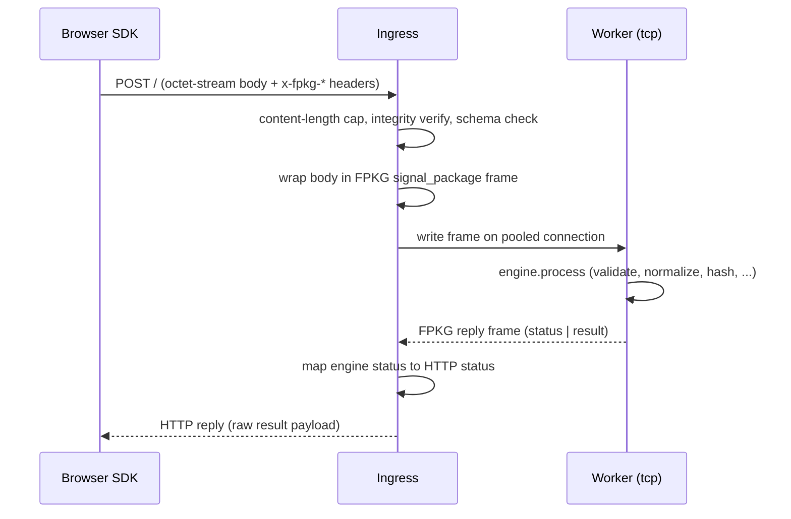

# Ingress design — F-1 (M5)

The HTTP ingress is the only component that speaks HTTP. It terminates the
browser SDK's POST, validates integrity, wraps the body in an FPKG frame,
forwards it to a pooled worker over the existing `--transport=tcp` path,
and translates the FPKG reply back to HTTP. It contains **no engine code**:
`engine.process()` stays exclusively in the workers (design §7, D16).

## Why a shared CLI folder with separate processes

The ingress scales differently from the workers (few replicas, long-lived
connections) and owns concerns the worker must never see: HTTP, TLS, rate
limiting, body-size policy, and worker selection. It therefore stays a
separate _process_ from the worker, but both apps now live in one CLI folder
(`src/cmd/`) per ADR-011: `main.zig` (combined `fingerprint` binary),
`worker.zig`, and `ingress.zig` each with their own `pub fn main`. This keeps
process separation (both ship as containers with a single entrypoint) while
sharing the CLI conventions, shutdown handling, and build plumbing. The
combined `fingerprint` binary is the single-artifact distribution;
`zig build worker` and `zig build ingress` produce the individual
components.

## The contract it serves (already fixed by the SDK)

`src/clients/browser/src/transport.ts` POSTs to `config.ingressUrl`
(default `http://127.0.0.1:8080`):

| Header                  | Example                    | Meaning                                                              |
| ----------------------- | -------------------------- | -------------------------------------------------------------------- |
| `content-type`          | `application/octet-stream` | raw SignalPackage v2 body                                            |
| `x-fpkg-schema-version` | `2`                        | body schema version                                                  |
| `x-fpkg-sdk-version`    | `0.3.0`                    | SDK version (informational)                                          |
| `x-fpkg-package-id`     | 32 hex chars               | replay identity                                                      |
| `x-fpkg-integrity`      | `sha256-<64 hex>`          | SHA-256 of the body (best-effort; the ingress enforces when present) |
| `origin`                | `https://example.com`      | CORS origin (optional)                                               |

The reply body is the worker's raw payload `u8 status | engine result`
(`fingerprint_result`: `[32]digest | u16 feature_count | u16 schema_version`
— see BUG-001; the ingress relays bytes verbatim and never interprets them).

## Request flow



## Ingress responsibilities

1. **Boundary checks** (before proxying):

   - Reject `Content-Length > max_body` with 413 (H-5). Configurable cap,
     default 1 MiB — far below the 16 MiB FPKG cap, comfortably above a real
     package (canvas/audio bytes are tens of KB).
   - If `x-fpkg-integrity` is present: compute SHA-256 of the body and
     compare; mismatch → 400. It must match the FPKG frame integrity the
     ingress computes anyway (same digest, zero extra work).
   - `x-fpkg-schema-version` must be a known schema (2; v1 tolerated per the
     engine's compatibility path, or rejected with 415 — decide in review).
   - `cross-origin` / CORS headers are optional; the ingress does not enforce them
     (the SDK does). checks the preflight `OPTIONS` request and responds with the appropriate CORS headers if needed.

2. **Frame translation**: reuse `adapter.buildFrame(.signal_package, .binary,
body, ...)` — the exact helper the worker already trusts.
3. **Worker pool**:
   - `--worker=host:port` (repeatable) seeds the pool; default from
     `FPKG_WORKERS` env (comma-separated) for containerized deploys.
   - Round-robin selection; a connect/write error re-routes to the next
     worker and retries once (safe: workers are stateless and deterministic —
     any worker can process any package).
   - Idle connections are reused (avoid per-request TCP handshakes). Each
     pooled connection maps to the worker's single-client-at-a-time accept
     loop; open enough connections per worker for the desired concurrency
     (H-1 timeouts in the worker make a stalled connection self-healing).
4. **Reply translation**: relay the worker payload verbatim; map `engine.Status`
   to HTTP:
   - `ok` → 200
   - `invalid_request` / `invalid_payload` / `invalid_codec` → 400
   - `unsupported_version` → 415
   - `buffer_overflow` → 413
   - everything else → 502 (upstream/worker fault)
   - Response headers: `content-type: application/octet-stream`,
     `x-fpkg-message-type: fingerprint-result`.
5. **Health**: `GET /healthz` → 200 `{ "status": "ok", "version": "..." }`
   (H-3). Liveness of the pool is derived by the ingress from worker
   connections; a `--health-only` mode may be added for load-balancer probes.
6. **Graceful shutdown** (H-2): SIGTERM/SIGINT → stop accepting, drain
   in-flight requests and pool connections, exit.

## Out of scope (explicitly)

- Engine computation, risk, similarity — workers only.
- AMQP — the worker publishes; the ingress never touches the broker.
- The fraud-platform WebSocket (`connectDecisionSocket`) — separate system.

## CLI (mirrors the worker)

```
# Standalone binary (zig build ingress -> zig-out/bin/ingress)
ingress start --listen=host:port --worker=host:port [--worker=...]
              [--max-body=bytes] [--log-level=level] [--log-format=text|json]
ingress version
ingress help

# Combined binary (zig build fingerprint -> zig-out/bin/fingerprint)
fingerprint ingress start --listen=host:port --worker=host:port [--worker=...]
fingerprint ingress version
fingerprint ingress help
```

Both invocations share the same parser (`ingress.parse`, ADR-011 argv
contract).

## Build, deploy, CI

- `src/cmd/ingress.zig` (imports `io` + `adapter` framing helpers only —
  never `engine`), built by `zig build ingress` → `zig-out/bin/ingress`;
  also shipped inside the combined `fingerprint` binary
  (`zig build fingerprint` → `zig-out/bin/fingerprint`, ADR-011).
- `deploy/Dockerfile.ingress` — same multi-stage alpine pattern as
  `deploy/Dockerfile.worker` (host-built binary, tini, non-root, EXPOSE
  8080/8443).
- `zig build docker:ingress` (tag `fingerprint-ingress:<version>` from
  `package_version`, mirroring `build_docker_worker`).
- `compose.yml`: `ingress` service wired to `worker` + `rabbitmq` (F-5).
- `release.yml`: publish `fingerprint-ingress` to GHCR alongside the worker
  and list it in the release notes (F-6).
- `ci.yml`: `ingress-build` job (build + docker image + entrypoint smoke).

## Tests

- Unit: header validation (missing/mismatched integrity, bad schema,
  oversized body), frame wrapping, status→HTTP mapping.
- Integration (extend `src/integration_tests.zig`): spawn a real worker
  (tcp, ephemeral port) + the ingress binary, POST the canonical
  `signal-package-v2.bin` fixture, assert the reply matches the pinned
  digest (the same constant the worker e2e tests use — cross-checks the
  whole HTTP→FPKG→worker→HTTP path against the reference engine).
- Pool: one dead worker + one live worker → the retry lands on the live one
  with the same digest (determinism makes this a strong assertion).
- Graceful shutdown: SIGTERM mid-poll → clean exit code.
