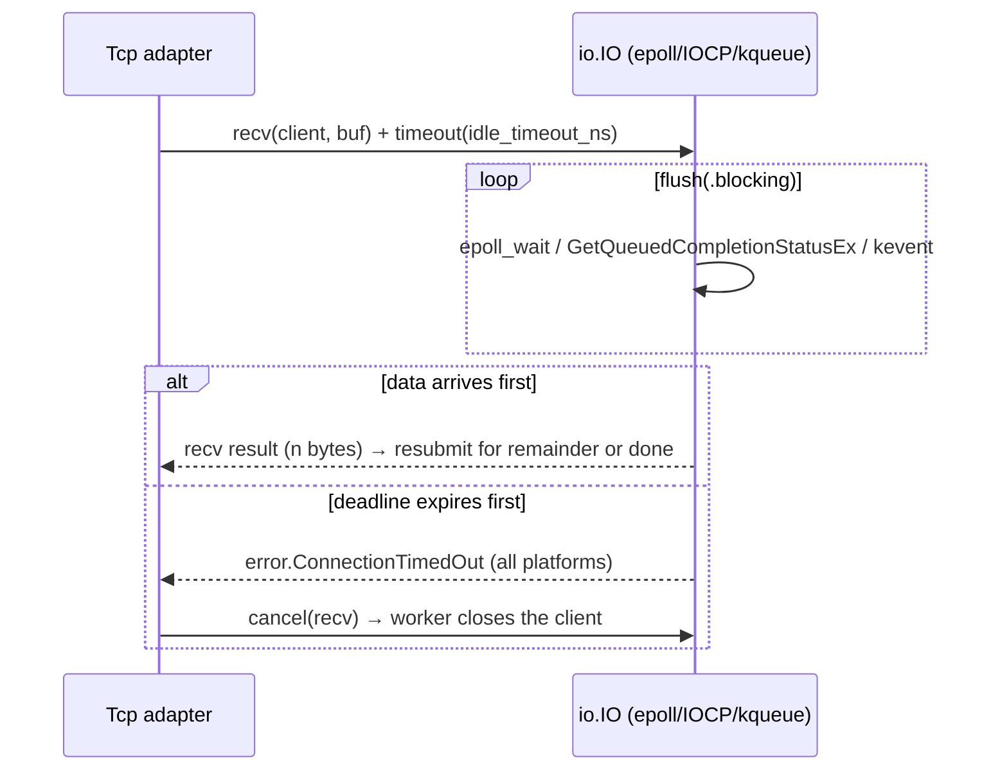

# Worker resilience — H-1 idle timeout, H-2 graceful shutdown

Slice S1 of the 2026-08-08 audit (`specs/quality/audits/2026-08-08.md`), story
`s1-bug001-timeouts-shutdown`. BUG-001 shipped in PR #16; this document covers
the two hardening gaps that remain:

- **H-1** — no socket idle timeout on the worker TCP transport (medium/high).
- **H-2** — no graceful shutdown (medium).

Both are implemented with a **completion-based async IO layer**
(`src/io/linux.zig`, `src/io/windows.zig`, `src/io/darwin.zig`) modeled on
TigerBeetle's `src/io/` — our own flavor, per D7. Deadline completions race
every socket operation, so timeouts work **identically on every platform**.

## Scope

- `src/io/` — the new completion-based event loop backends (epoll on Linux,
  IOCP on Windows, kqueue on Darwin) plus the shared `common.zig` and
  intrusive `queue.zig`. The existing user-space primitives (`reader`,
  `writer`, `frame`, `message`, `ring_buffer`, `channel`, `dispatcher`) are
  untouched; `executor`/`completion` stay as the deterministic user-space
  FIFO the channel parks on.
- `src/adapter/tcp.zig` — the TCP transport is rebuilt on the io layer:
  sockets are always non-blocking, every read races a deadline completion,
  `acceptWait` races accept against a wait deadline.
- `src/worker/main.zig` — no functional change required: the shutdown flag,
  signal handlers, and the accept/serve loop shape stay; `readFrame` /
  `acceptWait` now run the io loop internally.
- `src/integration_tests.zig` — e2e coverage for both behaviors.
- Unit tests in `tests/io/io_test.zig`, `tests/worker/worker_test.zig` and
  `tests/adapter/tcp_test.zig`.

The loopback transport and the engine are untouched. Logging remains
`std.debug.print` (S3 is a separate slice); only the existing announcement
lines change where the loop restructure requires it.

## Why SO_RCVTIMEO is dead (findings)

The first H-1 design applied `SO_RCVTIMEO` to accepted sockets. On this
project's Windows dev box the approach was **proven unreliable**: once a
socket has been non-blocking (required for H-2's bounded `acceptWait`),
Winsock's `SO_RCVTIMEO` silently stops firing — every probe combination
(blocking restore via FIONBIO, double-toggle, direct recv) either blocked
past the deadline or returned instantly with `WouldBlock`. `std.net.Stream`
reads (via `ReadFile`) ignore the option entirely, and `std.posix.recv`
requires libc on Windows. See `zig-out/probe_*.zig` (deleted after the
rewrite) for the probe matrix.

**Conclusion:** a deadline must come from the event loop, not the socket.
This also unifies the three platforms on one code path and removes the
Windows-only `WsaReader` shim.

## Design — completion-based io layer

### Event loop backends

| Platform | Backend | File | Status |
|----------|---------|------|--------|
| Linux | epoll (level-triggered) | `src/io/linux.zig` | CI-covered |
| Windows | IOCP | `src/io/windows.zig` | dev-box covered |
| macOS/iOS/tvOS/watchOS | kqueue | `src/io/darwin.zig` | compile-checked (`zig build worker -Dtarget=x86_64-macos`); runtime needs a Mac |

`io_uring` is the documented **design vision** for the Linux backend (the
ingress will hold a pool of workers and each worker may process multiple
requests concurrently); epoll is the v1 implementation because it is
available everywhere and is a strict subset of the same completion model.
Switching to io_uring later is a drop-in backend replacement — the
`Completion`/`submit`/`flush` contract does not change.

Every backend exposes the same surface, so the adapter and worker are
platform-agnostic:

- `IO.init(entries, flags)`, `deinit`
- `run()` — non-blocking flush; `run_for_ns(ns)` — blocking flush with a
  watchdog deadline; `flush(.blocking|.non_blocking)` — the primitive the
  adapter races
- `now()` — monotonic nanoseconds since `IO.init`
- `accept`, `recv`, `send`, `timeout`, `cancel`
- `open_socket_tcp(family, options)`, `close_socket`, `listen`, `shutdown`
- `Completion` (embedded, zero-allocation) with an `Operation` union and a
  `Context { io, completion }` callback; `submit()` wraps user callbacks and
  handles the `WouldBlock` re-queue, exactly like TigerBeetle's io.

Internal shape (adapted from TigerBeetle `src/io/windows.zig` / `darwin.zig`):

- `timeouts` / `completed` are intrusive FIFOs (`src/io/queue.zig`,
  `QueueType(Completion)` over the completion's embedded `link`).
- `submit` pushes onto `completed`; the first `do_operation` pass starts the
  kernel operation and, on `error.WouldBlock`, parks the completion (the
  kernel owns it) and bumps `io_pending`. A later kernel event pushes it back
  onto `completed`; the second pass harvests the result and invokes the user
  callback. Timeouts go straight into the `timeouts` queue keyed by a
  monotonic deadline.
- `flush` always checks expired timeouts first, waits for kernel events with
  the soonest deadline (or polls with 0), re-checks timeouts so
  same-instant deadlines batch, then drains `completed` (callbacks may push
  new completions, picked up in the same pass).
- epoll specifics: sockets are non-blocking; the first pass registers the fd
  (`EPOLL_CTL_ADD`, level-triggered, completion pointer in `data.ptr`), the
  second pass performs the syscall. A spurious wake returns `WouldBlock` and
  the level-triggered registration simply re-fires. `io_pending` counts
  registered fds (incremented at registration, decremented on finish/cancel).

### Deadline race (H-1)

A read is a race between a `recv` completion and a `timeout` completion:



- The deadline is armed per read stage (frame header, then payload), so a
  slow-loris that stalls mid-frame is bounded too.
- The loser of the race is cancelled: `cancel()` unlinks the completion from
  the `timeouts`/`completed` queues and unregisters the fd (`EPOLL_CTL_DEL`,
  or `CancelIoEx` on Windows; the aborted completion is delivered later and
  completes `error.Canceled`, which stale-generation checks ignore).
- Every read timeout surfaces **`error.ConnectionTimedOut` on all
  platforms** — the platform-specific error mapping (WouldBlock vs
  EndOfStream vs ConnectionTimedOut) is gone.

### Bounded accept (H-2)

`acceptWait(timeout_ms)` races `accept` against `timeout(timeout_ms)`; the
worker's accept loop keeps its shape:

```zig
while (!shutdown_requested.load(.acquire)) {
    if (!try t.acceptWait(accept_poll_ms)) continue; // 250 ms, observes the flag
    serve(adapter.Tcp, &t, alloc, publisher_ptr) catch |err| {
        if (peerGone(err)) continue;
        t.closeClient();
        continue;
    };
}
```

`serve()` checks the flag at the top of the frame loop: an in-flight request
completes (process → reply → publish → ack) before the drain exits.
`readFrame` stays bounded by H-1, so an idle client cannot stall the drain
indefinitely. SIGTERM/SIGINT → exit 0.

### Behavior matrix

| Event | Idle accept loop | In-flight request | Result |
|-------|------------------|-------------------|--------|
| SIGTERM/SIGINT | exits within ≤250 ms (acceptWait deadline) | finishes, then exits | exit 0 |
| Client disconnect | serve returns via `peerGone`, loop continues | — | no change |
| Idle client (H-1) | closed after `--idle-timeout-ms` | — | no change |

## CLI

`--idle-timeout-ms=N` — default `30000`, `0` disables. The default is on
because the ingress spec (F-1) relies on worker timeouts to self-heal stalled
pool connections.

## Build notes

Darwin has no `std.posix.system` without libc (kqueue, `EVFILT`, `EV`, …), so
roots that transitively import `io` link libc on Darwin targets only
(`build.zig`, `link_libc_on_darwin`). Linux and Windows stay libc-free; the
backend surface is identical either way.

## Tests

Unit (`tests/io/io_test.zig`):

- `run` returns immediately when idle (non-blocking flush).
- A `timeout` completes after its deadline (bounded by `run_for_ns`).
- Multiple timeouts complete in deadline order.
- `cancel` prevents a queued timeout from firing.
- `accept` completes when a client connects (threaded, loopback).
- `accept` loses to the deadline when no client connects.

Unit (`tests/worker/worker_test.zig`): `parse` accepts `--idle-timeout-ms`
(default 30000, override, `0` disables) and rejects a non-numeric value.

Unit (`tests/adapter/tcp_test.zig`):

- `acceptWait` returns false when no client connects within the timeout, and
  true when a client connects (threaded).
- `readFrame` fails `error.ConnectionTimedOut` on a silent client after a
  short `idle_timeout_ns` (threaded; ~200 ms — the timeout must be long
  enough that a slow CI box does not flake, short enough to keep the suite
  fast).

Integration (`src/integration_tests.zig`, spawned worker binary):

- **H-1 e2e** "worker closes an idle tcp client and keeps serving": spawn
  `--transport=tcp --listen=127.0.0.1:0 --idle-timeout-ms=500`; client A
  connects and sends nothing; sleep 1.5 s; client B connects, exchanges the
  canonical `signal-package-v2.bin`, and gets the pinned digest — proving the
  accept loop was not wedged. A read on A returns 0 (EOF): the worker closed
  it.
- **H-2 e2e** "worker exits 0 on SIGTERM" (POSIX-only, skipped on Windows):
  spawn with `--idle-timeout-ms=500` (so an idle readFrame is bounded),
  exchange one frame (digest pinned), send SIGTERM (`Child.kill()` →
  SIGTERM on POSIX), `Child.wait()`, assert `Term.Exited == 0`.

## Open questions (deferred)

- H-3 health probe and H-4/H-5 security posture are separate slices (S4 +
  the ingress milestone); this document does not change their status.
- macOS/BSD runtime coverage needs a Mac runner; today the kqueue backend is
  compile-checked via `zig build worker -Dtarget=x86_64-macos`.
- io_uring remains the Linux design vision (see above); epoll is v1.
