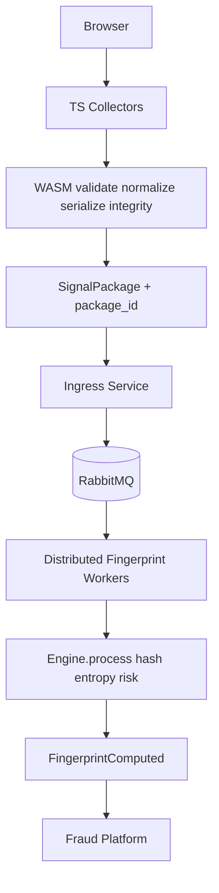
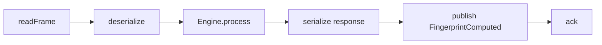

# Phase 2 — Design (Fingerprint Engine Rework)

Status: Draft for approval (2026-08-07)
Decisions source: `specs/rework/DECISIONS.md` (D1–D12).

## 1. Design goals

1. **Deterministic computation engine**, not a service. No transport, no
   networking, no queues, no auth inside the engine (REWORK absolute rules).
2. **Browser never generates the canonical fingerprint.** Browser produces a
   versioned `SignalPackage`; workers canonicalize.
3. **Everything depends inward** — adapters → engine → core → model; io is
   foundation.
4. **Async-first IO** at the transport boundary, minimal,
   portable, deterministic core.
5. **Stateless, replayable, versioned messages** with integrity.
6. **Zig 0.14.1** baseline from day one; every commit compiles and passes tests.

Non-goals for v1: real RabbitMQ client (v2), multi-threaded executor, Pipeline/
Command abstractions, protobuf/flatbuffers/capnproto codecs (interface ready,
codecs later).

## 2. Layering

```
┌─────────────────────────────────────────────────────────────┐
│  worker/   adapter/   browser/   sdk/   tools/              │  consumers
├─────────────────────────────────────────────────────────────┤
│                       engine/                               │  orchestration
├─────────────────────────────────────────────────────────────┤
│  core/  (algorithms)        serialization/  (codecs)        │  computation
├─────────────────────────────────────────────────────────────┤
│                     model/  (pure data)                     │  data
├─────────────────────────────────────────────────────────────┤
│                     io/  (async primitives)                 │  foundation
└─────────────────────────────────────────────────────────────┘
```

Dependency rule: a layer may import itself and everything below it. `model/`
and `io/` depend on nothing (only std). `engine/` depends on `core/`,
`serialization/`, `model/`. `adapter/` depends on `io/` + `engine/`.
`worker/` depends on `engine/` + `adapter/`. `browser/` (wasm) depends on
`engine/`. No circular imports; enforced by review + `zig build` module graph.

## 3. Module tree (final)

```
src/
├── model/
│   ├── feature.zig        FeatureID, FeatureType, FeatureCategory,
│   │                      FeatureFlags, FeatureDefinition     (from features/model.zig)
│   ├── definitions.zig    compile-time definition table       (from features/definitions.zig)
│   ├── registry.zig       compile-time O(1) lookup             (from features/registry.zig)
│   ├── value.zig          FeatureValue tagged union            (from fingerprint/value.zig)
│   ├── feature.zig        Feature { id, value }                (from fingerprint/feature.zig)
│   ├── metadata.zig       FingerprintMetadata                  (from fingerprint/metadata.zig)
│   ├── fingerprint.zig    Fingerprint                          (from fingerprint/fingerprint.zig)
│   └── root.zig
├── core/
│   ├── hashing/           hasher, feature, fingerprint         (moved)
│   ├── entropy/           entropy                              (moved)
│   ├── similarity/        feature, fingerprint                 (moved)
│   ├── risk/              risk                                 (moved)
│   ├── normalization/     types, bounds, normalize             (moved)
│   ├── validation/        required                             (moved)
│   └── root.zig
├── serialization/
│   ├── codec.zig          comptime Codec interface (encode/decode)
│   ├── binary.zig         SignalPackage v2 TLV body            (rewritten)
│   ├── json.zig           JSON body                            (rewritten)
│   └── root.zig
├── engine/
│   ├── operation.zig      Operation enum(u8)
│   ├── request.zig        Request
│   ├── response.zig       Response, Status
│   ├── engine.zig         process() + comptime dispatch table
│   ├── ops/               validate.zig normalize.zig serialize.zig deserialize.zig
│   │                      hash.zig entropy.zig similarity.zig risk.zig package.zig
│   └── root.zig
├── io/
│   ├── message.zig        Message (arena-backed, ownership)
│   ├── ring_buffer.zig    fixed-capacity SPSC ring
│   ├── channel.zig        typed SPSC channel
│   ├── completion.zig     Completion { ctx, callback }
│   ├── executor.zig       async event loop (submit/tick/run)
│   ├── frame.zig          FPKG envelope encode/decode
│   ├── reader.zig         fixed-buffer Reader (version-proof, no std.io dep)
│   ├── writer.zig         fixed-buffer Writer (same)
│   ├── dispatcher.zig     comptime op → handler routing
│   └── root.zig
├── adapter/
│   ├── transport.zig      comptime Transport interface contract
│   ├── loopback.zig       in-memory transport (+ stdin/stdout framing)
│   ├── amqp/
│   │   ├── codec.zig      AMQP 0-9-1 frame encode/decode (v1)
│   │   └── root.zig       v2: client (connection/channel/reconnect/DLQ/confirms)
│   └── root.zig
├── worker/
│   └── main.zig           tiny executable, comptime transport injection
├── browser/
│   ├── wasm/root.zig      stateless exports (rewritten)
│   ├── bindings/          TS: package builder (rewritten engine.ts)
│   └── collectors/        TS: signal gatherers (unchanged)
├── sdk/
│   └── browser/           npm package (moved from packages/)
├── tools/
│   ├── bench/             benchmark harness (moved from benchmark/)
│   └── scripts/           (moved from scripts/)
└── (no src root.zig — layered modules only)

deploy/
└── Dockerfile.worker      multi-stage: zig build worker → static binary
```

## 4. Engine API

### 4.1 Request / Response / Operation

```zig
pub const Operation = enum(u8) {
    validate = 1,      // validation + normalization passes → warnings
    normalize = 2,     // canonical normalization → normalized package
    serialize = 3,     // model → bytes (codec from request)
    deserialize = 4,   // bytes → model
    hash = 5,          // canonical digest (workers only; not exported to wasm)
    entropy = 6,       // entropy score
    similarity = 7,    // two packages (a, b) → score
    risk = 8,          // risk assessment
    package = 9,       // validate + normalize + serialize + integrity (browser's call)
};

pub const Request = struct {
    operation: Operation,
    codec: CodecID,          // binary = 1, json = 2 (default binary)
    payload: []const u8,     // borrowed input; similarity → dual-encoded payload
};

pub const Status = enum(u8) {
    ok = 0,
    invalid_request = 1,     // malformed operation/codec
    invalid_payload = 2,     // decode failure
    unsupported_version = 3, // envelope version mismatch
    invalid_input = 4,       // validation/normalization failed hard
    buffer_overflow = 5,
    out_of_memory = 6,
    internal_error = 7,
};

pub const Response = struct {
    operation: Operation,
    status: Status,
    payload: []u8,           // written into caller buffer; caller owns
    payload_len: usize,
};

pub fn process(req: *const Request, res: *Response, scratch: Allocator) !void;
```

- `process()` dispatches through a **comptime table** (`Dispatcher`): one row
  per `Operation` → handler fn. Adding an op = new `ops/*.zig` file + table
  row. Per-op public wrappers (`engine.validate(req,res,arena)`, ...) are
  one-liners around `process()` — the API surface can grow without rework
  (D3).
- **Determinism:** no clock, no RNG, no globals. `collected_at` and
  `package_id` are input data inside the payload.
- **Similarity pair:** payload = codec-encoded `{a, b}` container; `ops/
  similarity.zig` decodes both and calls `core.similarity.fingerprintScore`.
- Memory: input borrowed; output written to a caller-provided buffer (resize
  via `payload_len`); intermediate allocations come from `scratch` (arena).

### 4.2 Per-op behavior

| Op | Input | Output |
|----|-------|--------|
| validate | SignalPackage | ValidationResult (missing required, type, bounds warnings; ok flag) |
| normalize | SignalPackage | NormalizationResult (warnings + canonical feature set) |
| serialize | SignalPackage | bytes in requested codec |
| deserialize | bytes | SignalPackage |
| hash | SignalPackage (canonicalized) | FingerprintResult (digest, schema, feature count) |
| entropy | SignalPackage | entropy score (f64) |
| similarity | dual payload (a, b) | SimilarityResult (score, compared count) |
| risk | SignalPackage | RiskResult (score, label, flags) |
| package | raw collected features | SignalPackage envelope (validate→normalize→serialize→integrity) |

## 5. Message envelope ("FPKG")

Fixed little-endian frame header, versioned, integrity-protected:

```
FrameHeader (48 bytes):
  magic:        [4]u8  = "FPKG"
  version:      u16    = 1
  message_type: u8     (MessageType enum)
  codec:        u8     (1 = binary, 2 = json)
  payload_len:  u32
  reserved:     u32    = 0
  integrity:    [32]u8 = SHA-256(payload)
```

MessageType (u8): `signal_package = 1, validation_result = 2,
normalization_result = 3, fingerprint_result = 4, risk_result = 5,
similarity_result = 6, diagnostics = 7, fingerprint_computed = 8`.

Envelope versioning: unknown `version` → `unsupported_version` at the engine
boundary (worker rejects, adapter routes to DLQ in v2). Integrity: recomputed
on ingest; mismatch → `invalid_payload`; the adapter treats it as a
poison-message signal.

### 5.1 SignalPackage body v2 (codec = binary)

Fixes F4 (lossy round-trip) and adds replay identity:

```
SignalPackage body (little-endian):
  schema_version:  u16 = 2
  sdk_version_len: u16
  sdk_version:     [len]u8
  collected_at:    i64          (client-provided input data — engine never clocks)
  package_id:      [16]u8       (client-generated UUID bytes — correlation)
  feature_count:   u16
  features:        TLV ×N       (FeatureID u16 | type u8 | len u32 | payload — unchanged)
```

v1 decode (schema_version = 1, no sdk/collected_at/package_id) kept as a
compatibility path in `serialization/binary.zig` and covered by golden
fixtures. Other result messages use compact fixed layouts:
FingerprintResult = `{ digest: [32]u8, schema: u16, feature_count: u16 }`,
RiskResult = `{ score: f64, flags_len: u8, flags: u8× }`, etc.

### 5.2 Codec interface

```zig
// serialization/codec.zig — comptime interface, no vtables (convention: no
// dynamic dispatch).
pub const Codec = struct {
    id: CodecID,
    encode: fn (writer: anytype, value: anytype) anyerror!void,
    decode: fn (reader: anytype, allocator: Allocator, value: anytype) anyerror!void,
};
```

`binary` and `json` implement it; protobuf/flatbuffers/capnproto are future
implementations selected by `codec` in the envelope. Serialization operates on
`anytype` writers/readers, so it works with `io.Writer`/`io.Reader`, test
buffers, or adapters — and is insulated from std.io API churn across Zig
versions.

## 6. IO abstraction (async-first, minimal)

All primitives are sync-determined and portable; async is used by transports
and the worker loop. Engine itself remains synchronous.

| Type | Responsibility |
|------|----------------|
| `io.Message` | Arena-backed byte buffer with explicit ownership transfer. Caller gets a `Message`, writes payload, transfers it (channel/transport). `MessagePool` recycles arenas (arena-pool pattern, simplified). |
| `io.RingBuffer` | Fixed-capacity SPSC ring buffer over `[]u8` or `*Message` slots. |
| `io.Channel` | Typed SPSC channel over a `RingBuffer`: `send(T)`, `recv()`; blocking and completion-based variants. |
| `io.Completion` | `{ context: ?*anyopaque, callback: *const fn (*Completion) void }` — embedded in consumer structs, zero allocation (completion pattern). |
| `io.Executor` | Event loop: `submit(*Completion)`, `tick()`, `run(timeout)`. v1 single-threaded; queue drained deterministically for tests. Multi-threaded executor is a later, opt-in addition. |
| `io.Frame` | Encode/decode the FPKG FrameHeader over any Reader/Writer (used by loopback, worker pipes, and the future AMQP client). |
| `io.Reader` / `io.Writer` | Fixed-buffer readers/writers (own implementation — no std.io dependency, version-proof). |
| `io.Dispatcher` | Comptime op → handler table; used by `engine.process()` and the worker's message routing. |

Deferred (per D7): `Pipeline`, `Command`.

## 7. Adapter layer

### 7.1 Transport interface (comptime)

```zig
// adapter/transport.zig
// A Transport implements: init/deinit, readFrame, writeFrame, publish, ack/nack.
// The worker is generic over T: Transport — swapping loopback → amqp later is
// a CLI flag / comptime switch, zero worker logic changes.
```

### 7.2 Loopback transport (v1)

In-memory queues + stdin/stdout framing mode (`--transport=loopback`):
reads FPKG frames from stdin, writes FPKG frames to stdout. Enables e2e tests
via pipes and deterministic replay testing without a broker.

### 7.3 AMQP (staged)

- **v1 — codec only:** `adapter/amqp/codec.zig` implements AMQP 0-9-1 frame
  framing (method/header/body frames, type/class decoding). Tested against
  captured byte fixtures — no broker required.
- **v2 — client:** connection, channels, exchange/queue declare, basic.publish
  with publisher confirms, basic.consume, heartbeats, reconnect with backoff,
  dead-letter queue handling. All RabbitMQ knowledge stays here — never in
  `engine/`.

Adapter flow (v2, for reference):

```
AMQP consumer
  → decode method/header/body frames
  → Frame → Request (operation derived from message_type + routing key)
  → engine.process()
  → Response → encode frame → publish to result exchange
  → ack/nack (poison → DLQ after retries with backoff)
```

## 8. Worker

```zig
// src/worker/main.zig — ~80 lines. No business logic.
// CLI: --transport=loopback|amqp, --input=stdin|queue, --output=stdout|exchange
loop:
  frame = transport.readFrame()
  message = deserialize(frame)
  request = mapMessageToRequest(message)
  engine.process(request, response, arena)
  publish(serialize(response))        // FingerprintComputed for signal packages
  transport.ack(frame)
```

The worker's canonical path for a `SignalPackage`:

```
SignalPackage → validate → normalize → hash → entropy → risk →
FingerprintComputed { result, package_id, integrity } → publish
```

## 9. Browser / WASM

### 9.1 Research: can WASM stay in the collection path?

**Yes.** The new architecture's browser flow explicitly includes WASM between
collectors and the ingress:

```
Browser
  → TS collectors (canvas, webgl, audio, fonts, ...)
  → WASM: validate → normalize → serialize → integrity → package
  → SignalPackage bytes → ingress
```

WASM is the *packaging* layer, not the *canonicalization* layer. The only
removed capability is canonical digest generation — which is enforced by simply
not exporting `hash` to WASM. Collection (signal gathering) stays in TS;
packaging (validation/normalization/serialization/integrity) stays in WASM.
Optional lightweight risk can remain for client-side UX, explicitly labeled
non-canonical. The WASM artifact also serves two infra uses: **benchmark
harness** and **test containers** (e.g., wasmtime) that emulate browser signal
collection deterministically in CI.

### 9.2 New WASM exports (stateless)

```
fp_version() -> u32
fp_process(op: u32, in_ptr: u32, in_len: u32, out_ptr: u32, out_cap: u32) -> i32
    // returns written length, or negative Status on error
fp_alloc(len: u32) -> u32
fp_free(ptr: u32) -> void
```

No global feature buffer, no init/reset, no scratch ownership games: JS
allocates input via `fp_alloc`, calls `fp_process`, reads the output region.
`package` (op 9) is the primary browser entry — its output IS the
`SignalPackage` envelope to upload. `engine.ts` becomes a package builder:
`collect()` → `package()` → bytes; `compute()`/`collectAndCompute()` are
removed.

## 10. Docker

`deploy/Dockerfile.worker` — multi-stage:

1. Build stage: `zig build worker --release=safe` (0.14.1 registers
   `--release`/`-Drelease` when a preferred mode is set; `-Doptimize` is not
   accepted).
2. Runtime stage: copy the static `worker` binary; `ENTRYPOINT ["/worker",
   "--transport=amqp"]` (v2) or loopback for dev.

Static Zig binary → distroless/scratch runtime. CI adds a worker-build +
`docker build` job. No native library, no C ABI, no header.

## 11. Event flows

### 11.1 End-to-end (canonical)



### 11.2 Worker internals



### 11.3 Dependency graph

```mermaid
flowchart TD
    MODEL[model - zero deps] --> CORE[core algorithms]
    IO[io - zero deps] --> SER[serialization]
    MODEL --> SER
    CORE --> ENG[engine]
    SER --> ENG
    IO --> ENG
    ENG --> AD[adapter]
    IO --> AD
    ENG --> BRO[browser wasm]
    ENG --> WK[worker]
    AD --> WK
```



## 12. Testing strategy

| Suite | Covers |
|-------|--------|
| `tests/model/` | feature definitions, registry, values, metadata (moved) |
| `tests/core/` | hashing, entropy, similarity, risk, normalization, validation (moved) |
| `tests/serialization/` | binary v1 compat, binary v2 round-trip, JSON, codec interface |
| `tests/engine/` | request/response, per-op behavior, dispatch table, determinism, replay goldens, unknown-version rejection |
| `tests/io/` | message ownership, ring buffer, channel, completion, executor drain, frame encode/decode |
| `tests/adapter/` | transport contract, loopback e2e, AMQP codec vs byte fixtures |
| `tests/worker/` | pipe e2e: frames in → FingerprintComputed out; replay determinism |
| `tests/browser/` | wasm export surface (stateless), bindings compile |
| `tests/fuzz/` | decode, hashing, normalize (kept) |

All existing tests are preserved (relocated) except `tests/server/*`, which die
with the native SDK (D10).

## 13. Documentation deliverables

Final `docs/` files (land with implementation): `Architecture.md`, `Engine.md`,
`IO.md`, `Worker.md`, `AMQP.md`, `Serialization.md`, `Migration.md`,
`Design.md`. `docs/api.md` and `docs/architecture.md` are rewritten to drop the
deprecated browser-canonical and native-SDK content.
