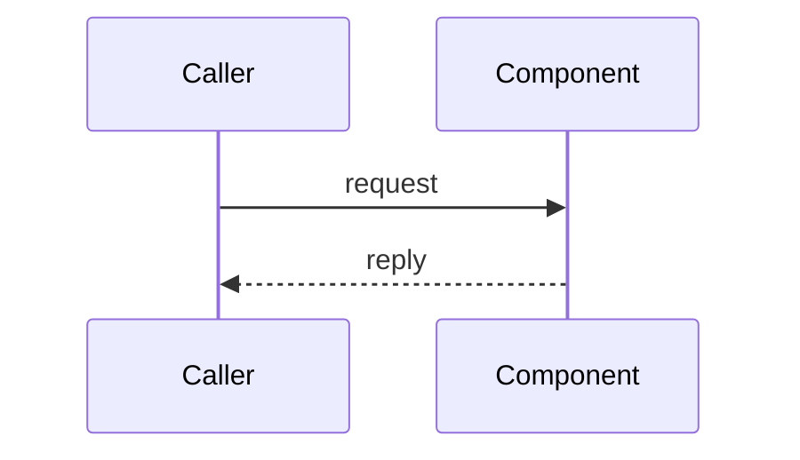

# <Subsystem> design — <Ref ID (e.g. F-1) / milestone>

One-paragraph summary: the problem, the component, and the boundary it must
not cross (e.g. "contains no engine code").

## Context / why

Why this exists, what it connects to, and the decisions it implements
(link the ADR / decision numbers).

## Contract

The wire/API contract it serves (headers, payloads, statuses, message types)
with concrete examples. This section is normative — implementations must
match it.

## Flow

## Responsibilities

Numbered list of responsibilities, each with acceptance criteria.

## Out of scope (explicitly)

What this design deliberately does not do, and where that work lives instead.

## CLI / configuration

Flag table with defaults and env-var overrides (option → env → default).

## Build, deploy, CI

The zig build steps, Dockerfile, CI jobs, and release-surface changes.

## Tests

- Unit: ...
- Integration: ...
- Verification checklist pointer (`quality/verifications/...`).
