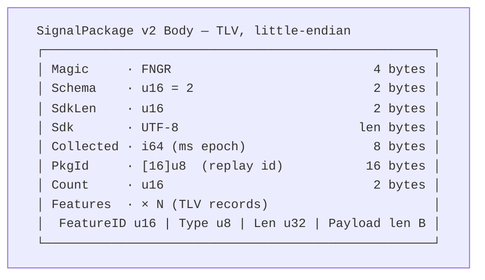

# Serialization

This guide documents exactly what crosses the wire in a Fingerprint Engine
deployment. There are two distinct layers, and it is important not to confuse
them:

1. The **SignalPackage v2 body** — the application payload that the browser
   SDK packs and the worker's `engine.process()` consumes. It is versioned,
   self-describing, and little-endian.
2. The **FPKG envelope frame** — the transport-level framing used between the
   ingress and the worker. It wraps a serialized body (or other engine
   messages) with a fixed header and an integrity digest.

Both layers are deterministic: the same logical object serializes to the same
bytes on any platform. This byte-for-byte stability is what makes replay
identity and golden-fixture testing possible. See
[Concepts](/docs/concepts/determinism/) for the reasoning.

## The SignalPackage v2 body

The v2 body is a versioned TLV (Type-Length-Value) encoding, little-endian
byte order throughout. It is produced by the browser SDK's `package.ts`
(mirroring `serialization/binary.zig` byte-for-byte) and consumed by the
worker. The layout is:



### Header fields

| Field | Size | Type | Description |
| ----- | ---- | ---- | ----------- |
| Magic | 4 bytes | bytes | The literal ASCII `FNGR`. Identifies the container as a fingerprint package. |
| Schema version | 2 bytes | `u16` | The schema version of the body — `2` for SignalPackage v2. |
| SDK version length | 2 bytes | `u16` | Byte length of the SDK version string that follows. |
| SDK version | variable | bytes | NUL-terminated-free UTF-8 version string of the collecting SDK. |
| Collected at | 8 bytes | `i64` | Milliseconds since the Unix epoch at collection time. |
| Package ID | 16 bytes | `[16]u8` | A 16-byte replay identity chosen by the collector. |
| Feature count | 2 bytes | `u16` | Number of TLV feature records that follow. |
| Features | variable | TLV records | `Feature count` records, each as described below. |

The **package id** is the collector's replay identity. Because workers are
stateless, re-processing the same package id with the same bytes must yield
the same digest; the id enables deduplication and end-to-end tracing. The
**collected-at** timestamp participates in fingerprint hashing, so a package
re-collected later is not identical to an earlier one even when the feature
values match — this is intentional.

Unknown schema versions are handled at the engine boundary: a body whose
schema version is not recognized maps to `unsupported_version` and is
rejected rather than mis-parsed.

### TLV feature records

Each feature is a self-describing record with a fixed 7-byte header followed
by a typed payload:

```
FeatureID: u16 | Type: u8 | Payload Length: u32 | Payload
```

| Field | Size | Type | Description |
| ----- | ---- | ---- | ----------- |
| FeatureID | 2 bytes | `u16` | The feature identifier, registered in the compile-time feature registry. |
| Type | 1 byte | `u8` | A `FeatureType` tag denoting how the payload is shaped. |
| Payload length | 4 bytes | `u32` | Byte length of the payload that follows. |
| Payload | variable | bytes | The feature value, shaped by `Type` (below). |

`FeatureID` and `Type` are stable, compile-time constants derived from the Zig
model — they are the single source of truth shared with the generated
TypeScript tables. The `Type` tag makes each record self-describing, so a
decoder never guesses the shape of a payload.

### Payload shaping by FeatureType

The payload bytes are interpreted according to the `Type` tag. All integers
are little-endian. The shaping rules are:

| FeatureType | Payload encoding | Notes |
| ----------- | ---------------- | ----- |
| Boolean | `u8` | A single byte: `0` for false, `1` for true. |
| Integer | `i64` | A signed 64-bit little-endian integer. |
| Float | `u64` | The IEEE-754 bits of a double, **bitcast** to `u64` for a stable, byte-exact representation (not a textual conversion). |
| String | `u32 len + bytes` | A 4-byte length followed by that many UTF-8 bytes. |
| Bytes | `u32 len + bytes` | A 4-byte length followed by that many raw bytes. |
| Array | `u32 count + elements` | A 4-byte element count followed by the elements, each element itself shaped by its own FeatureType. |

Two points deserve emphasis in an enterprise setting:

- **Float is bitcast, not normalized.** A `f64` is taken as its raw 64-bit
  IEEE-754 representation via a bitcast to `u64`. NaN payloads, signed zeros,
  and subnormals therefore serialize exactly and deterministically as their
  bit patterns. Do not rely on platform floating-point formatting routines in
  a compatible serializer; replicate the bitcast.
- **Arrays carry a count.** Unlike a bare byte string, an array records how
  many elements it holds so a decoder can iterate them without guessing.

This is the same encoding as the earlier v1 body up to the schema-version
field; v2 introduced the explicit uint schema-version prefix and the TLV
feature records described here. Strings and byte blobs both use the
`u32 len + bytes` convention; the `Type` tag disambiguates their meaning.

## The FPKG envelope frame

Inbound to the worker (and outbound from it) is not the bare body but an
FPKG frame — a fixed transport envelope wrapping a message. The frame is
produced and consumed by the adapter layer (`adapter/transport.zig` with its
`Frame` primitive) and rides over the loopback or TCP transport.

A single frame carries a **48-byte header** followed by a variable-length
payload:

| Field | Size | Description |
| ----- | ---- | ----------- |
| Magic | 4 bytes | The literal ASCII `FPKG`, identifying the framing layer. |
| Envelope version | 2 bytes | The FPKG envelope version — `1` for the current frame layout. |
| Message type | 1 byte | `u8` — the FPKG message type (see [Worker CLI](/docs/guides/worker-cli/) for the mapping to engine operations). |
| Codec | 1 byte | `u8` — the `CodecID` of the payload (binary or JSON, below). |
| Payload length | 4 bytes | `u32` — byte length of the payload that follows the header. |
| Integrity digest | 32 bytes | `[32]u8` — the SHA-256 digest of the payload, used to verify the frame. |
| Payload | variable | The serialized message body, per the declared codec and message type. |

The header is `4 + 2 + 1 + 1 + 4 + 32 = 48` bytes. The integrity digest covers
the payload bytes: it is the SHA-256 of everything after the 48-byte header.
A receiver verifies the digest before trusting the payload, rejecting frames
whose digest does not match. This provides an end-to-end integrity check
between the ingress and the worker independent of any lower-level transport
checksums.

Combined, the frame layout is:

```
┌──────────────────────────────────────────────────────────────┐
│ "FPKG" (4) | Env Version u16=1 | Msg Type u8 | Codec u8       │
│ Payload Length u32 | Integrity [32]u8 (SHA-256 of payload)    │
│ Payload (length bytes, codec-encoded)                        │
└──────────────────────────────────────────────────────────────┘
```

## Binary versus JSON codecs

The `CodecID` field in the FPKG header selects which codec encoded the
payload. Two are available, traded off against each other:

| CodecID | Payload encoding | Strengths | Trade-offs |
| ------- | ---------------- | --------- | ---------- |
| Binary | Compact TLV / typed binary encoding | Small, fast, byte-exact, ideal for the canonical `signal_package → hash` path. | Not human-readable; requires the versioned binary parser. |
| JSON | Human-readable JSON | Debuggable, trivially inspectable, easy to synthesize in tests. | Larger, slower, and not used for the canonical fingerprint path. |

The **binary codec** is the default and the production choice: the SignalPackage
v2 body and the FPKG-framed engine requests/replies use it end to end, giving
the deterministic, byte-exact behavior the engine must guarantee. The **JSON
codec** exists for inspection and diagnostics — you can point a tool at a
JSON-encoded frame and read the fields directly, which is invaluable during
integration debugging, but it is not the path that computes the canonical
digest.

The engine dispatches on `CodecID` at comptime (a dispatch table, not a
runtime branch chain), so the same `engine.process()` invocation accepts
either encoding without any transport-specific branching.

## Signature of a correct serializer

A compatible client serializer must guarantee:

1. Little-endian byte order for every multi-byte integer.
2. `FNGR` and `FPKG` magic exactly as specified (no BOM, no padding).
3. Floats bitcast to `u64`, never rendered through a formatter.
4. Arrays prefixed by their element count; strings and byte blobs prefixed by
   their byte length.
5. Stable `FeatureID` and `Type` constants sourced from the shared model —
   never hand-maintained copies that can drift.

The TypeScript SDK satisfies these constraints via generated tables
(`zig build clients:browser`) and is parity-tested against the Zig golden
fixture (`signal-package-v2.bin`) so the two remain byte-for-byte aligned.

## Where the formats fit

- The **browser SDK** produces the `FNGR` SignalPackage v2 body and POSTs it
  to the ingress ([Browser SDK](/docs/guides/browser-sdk/)).
- The **ingress** re-wraps or forwards it to a worker inside an **FPKG**
  frame over loopback or TCP ([Worker CLI](/docs/guides/worker-cli/)).
- The **worker** teleports to the envelope, verifies integrity, decodes the
  body per the declared codec, and runs `engine.process()`.

For the deployment that pulls all of this together, see
[Docker Compose](/docs/guides/docker-compose/).
