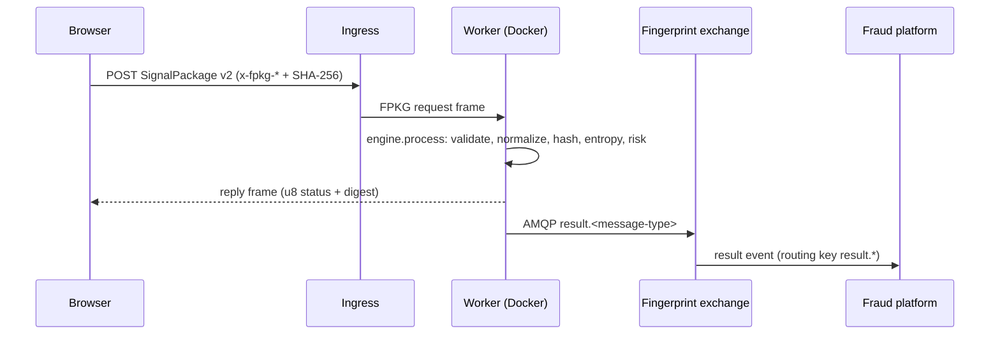

# Operating

The Fingerprint Engine is a deterministic, distributed system, and the
operations model follows from that sentence. The **browser collects**, the
**engine computes**, and the **platform decides** — as an operator you run the
middle link: an HTTP ingress in front of a pool of stateless worker
containers that compute fingerprints, risk, entropy, and similarity, and
publish every result as an AMQP event for the fraud platform to consume.

The whole stack is deliberately boring to operate:

- Two processes, the **ingress** (HTTP) and the **worker** (FPKG over TCP +
  AMQP publisher), plus a RabbitMQ broker.
- No databases to provision, no shared state, no leader election. Workers are
  stateless and interchangeable because the engine is deterministic: any
  worker, any platform, any restart produces the same output for the same
  input.
- A single command — `docker compose up` — runs the full pipeline on a
  laptop, which is the same topology you run in production (Container-Name
  hostnames resolved through `getaddrinfo`).

This section is the operating runbook: how to deploy, how the messaging
topology works, and how to verify and troubleshoot a running pipeline.

## Pages

| Page | What it covers |
| ---- | --------------- |
| [Deployment](./deployment.md) | The full `docker compose up` stack (RabbitMQ + worker + ingress), the GHCR container images produced by the release pipeline from annotated git tags, cross-platform native binaries, and how release artifacts are produced. |
| [AMQP Topology](./amqp-topology.md) | The durable `fingerprint` direct exchange, `result.<message-type>` routing keys, publisher confirms, persistent delivery, the dead-letter exchange/queue, and draining the DLQ. |
| [Monitoring](./monitoring.md) | Structured and flow logging, verifying each hop of the ingestion pipeline (package arrived? worker replied? event published?), draining the DLQ, and reproducing issues on a deterministic engine. |

## The event flow you are operating

A single fingerprint gets from browser to fraud platform through four hops.
Each hop is observable, and the monitoring page gives you the exact log line
to confirm it:

The worker is the only component that runs the engine, and the AMQP
publication is the only event stream the fraud platform consumes. When the
broker is down, the worker logs and drops publications (v1 policy) rather
than block page traffic — supervisors and broker persistence cover the rest.

## Core operational assumptions

- **The engine is deterministic.** Same input, same output, any platform, any
  time. There is no clock and no randomness inside the engine, which makes
  every failure reproducible from the exact input bytes. See
  [Concepts: Determinism](../concepts/determinism.md).
- **The ingress never computes.** It terminates HTTP, validates integrity and
  schema, forwards FPKG frames to a pooled worker, and relays the reply. It
  imports no engine code — the separation is structural, not a convention.
- **Workers are disposable.** A worker holds no queue, no cache, no
  in-memory session. Kill it and start another; the only consequence is
  whatever in-flight requests were on its socket.
- **The broker is the durable boundary.** Messages are persisted and
  broker-confirmed before the worker considers a publish complete; failed or
  rejected messages land in `fingerprint.dlq` for you to drain. See
  [AMQP Topology](./amqp-topology.md).

## Before you begin

- Read [Start](../start.md) to see the pipeline from the browser side.
- Read [Architecture](../architecture.md) for the layered module graph and
  the event flow.
- Read [Reference: API](../reference/api.md) for the worker/ingress CLI
  surfaces.

The rest of this section assumes you have a repository checkout with Zig
0.14.1 and Docker installed, and that you are comfortable with
`docker compose` and RabbitMQ management basics.