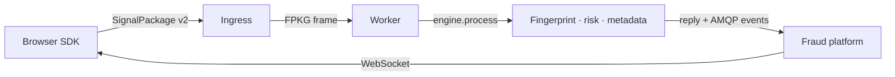
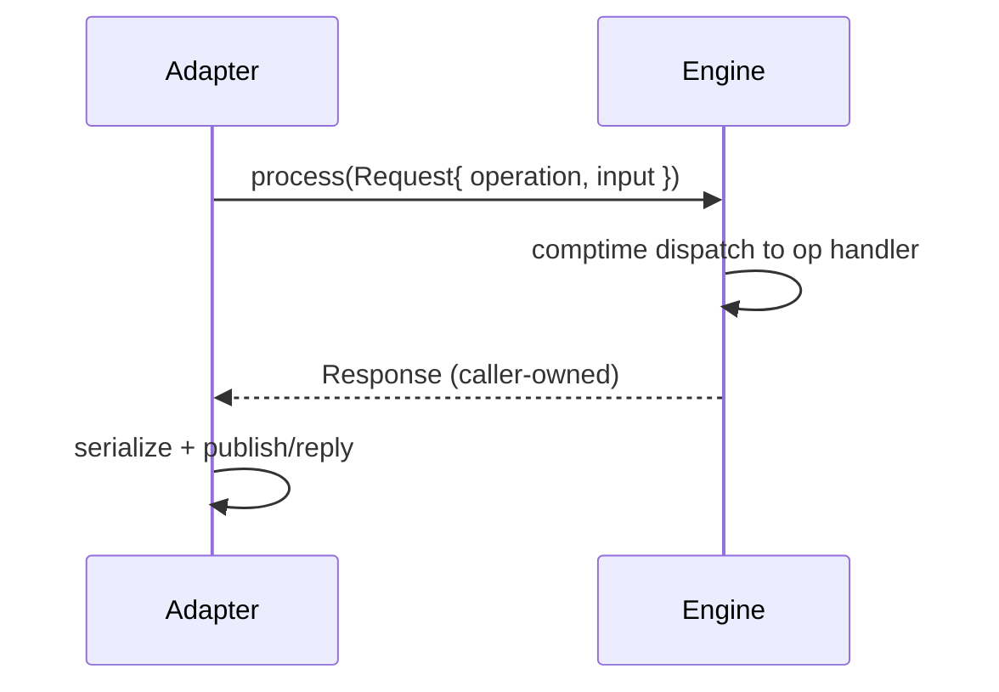

# Fingerprint Engine API Documentation

## Overview

The Fingerprint Engine is a deterministic computation engine written in
Zig 0.14.1. It provides:

- **Feature collection**: 102 browser signals across 21 categories (canvas, WebGL, audio, fonts, battery, media codecs, speech, input, permissions, etc.)
- **Deterministic hashing**: SHA-256 fingerprint digests
- **Normalization**: Type and bounds validation
- **Similarity scoring**: Feature-level and fingerprint-level comparison
- **Entropy analysis**: Shannon entropy measurement
- **Risk assessment**: Browser fingerprint risk scoring
- **Serialization**: Versioned TLV binary and JSON codecs
- **Engine**: Versioned `Operation`/`Status`, immutable `Request`, caller-owned `Response`, comptime dispatch
- **IO primitives**: Arena `Message`/`MessagePool`, `RingBuffer`, typed `Channel`, `Executor`, FPKG `Frame`, fixed-buffer `Reader`/`Writer`, comptime `Dispatcher`
- **Worker executable**: `--transport=loopback|tcp`, `--publish=none|amqp`, ships as a Docker container

The canonical fingerprint is computed **only** by the workers. There is no
native SDK and no C ABI. The browser TypeScript SDK collects signals and ships
a versioned `SignalPackage` to the ingress; it never computes the digest.

## Architecture





Dependencies flow inward: `model` → `core`/`serialization` → `engine`;
`io` → `adapter` → `worker`. Nothing depends outward; no circular imports.

## Quick Start

### Browser (TypeScript SDK)

```typescript
import { configure, collect, onSessionBlocked, assertAllowed } from '@akshay2642005/fingerprint-sdk';

configure({ ingressUrl: 'https://ingress.example.com/v1/fingerprints' });

const result = await collect();
console.log('package id:', result.packageId); // replay identity
console.log('signals:   ', result.signalCount);
console.log('sent:      ', result.sent);        // ingress accepted (HTTP 2xx)
console.log('reply:     ', result.reply);       // worker digest, when relayed
```

`collect()` returns:

| Field | Type | Description |
| ----- | ---- | ----------- |
| `packageId` | `Uint8Array` | 16-byte replay identity |
| `bytes` | `Uint8Array` | serialized SignalPackage v2 body (exact bytes POSTed) |
| `hex` | `string` | hex of `bytes` |
| `signalCount` | `number` | number of signals collected |
| `sent` | `boolean` | ingress accepted the package (HTTP 2xx) |
| `reply` | `WorkerReply?` | worker digest, when relayed |

`WorkerReply`: `{ status, digestHex?, schemaVersion?, featureCount? }` — the
`status` byte is the engine `Status` value (0 = ok).

Fraud-platform middleware:

```typescript
onSessionBlocked((decision) => UI.notify(`blocked: ${decision.reason}`));
if (assertAllowed().blocked) return; // client-side UX gate; app enforces
```

### Engine (Zig)

```zig
const engine = @import("engine");

// Operations: validate, normalize, serialize, deserialize, hash,
//             entropy, similarity, risk, package
var response = try engine.process(allocator, &request);
defer response.deinit(allocator);
```

`engine.process()` is the single entry point: it takes an immutable
`Request` (operation + input slices) and produces a caller-owned `Response`.
Dispatch is a comptime table — no reflection, no dynamic dispatch.

## Core Modules

### Model (`model`)

Defines the 102 browser signals and their metadata across 21 categories.

```zig
const model = @import("model");

// FeatureID enum values:
// .UserAgent, .Language, .Platform, .HardwareConcurrency,
// .DeviceMemory, .ScreenWidth, .ScreenHeight, .Timezone, etc.
```

The runtime data model (`Fingerprint`, `Feature`, `FeatureValue`, metadata,
registry) depends on nothing.

### Hashing (`core.hashing`)

Deterministic SHA-256 fingerprinting.

```zig
const core = @import("core");

// Hash a single feature
var hash: [32]u8 = undefined;
try core.hashing.hashFeature(feature.value, &hash);

// Hash an entire fingerprint
try core.hashing.hashFingerprint(fingerprint, &hash);

// Incremental hashing
var hasher = core.hashing.Hasher.init(schema_version, sdk_version, collected_at);
try hasher.add(feature.id, feature.value);
hasher.final(&hash);
```

### Serialization (`serialization`)

Versioned binary and JSON encoding/decoding. The binary body is schema v2:
`"FNGR"` magic, `u16` schema version, SDK version, `i64` collected-at,
`[16]u8` package id, `u16` feature count, then TLV features.

```zig
const serialization = @import("serialization");

// Binary encode
var w = std.io.fixedBufferStream(&buf);
try serialization.encode(&w, fingerprint);

// Binary decode
var decoded = try serialization.decode(&r, allocator);
defer decoded.deinit();

// JSON encode
try serialization.jsonEncode(&json_w, fingerprint);
```

### Normalization (`core.normalization`)

Type and bounds validation.

```zig
const type_warnings = try core.normalization.validateTypes(fingerprint, allocator);
defer allocator.free(type_warnings);

const bound_warnings = try core.normalization.checkAllBounds(fingerprint, allocator);
defer allocator.free(bound_warnings);
```

### Similarity (`core.similarity`)

Feature-level and fingerprint-level comparison.

```zig
const score = core.similarity.featureScore(value_a, value_b);       // 0.0–1.0
const fp_score = core.similarity.fingerprintScore(fp_a, fp_b);      // 0.0–1.0
```

### Entropy (`core.entropy`)

Shannon entropy measurement.

```zig
const entropy = core.entropy.shannonEntropy(data);                  // bits/byte
const fp_entropy = core.entropy.fingerprintEntropy(fingerprint);    // weighted bits
```

### Risk (`core.risk`)

Browser fingerprint risk assessment.

```zig
const assessment = core.risk.computeRisk(fingerprint, allocator);
// assessment.score: 0.0 (low risk) to 1.0 (high risk)
// assessment.label: .low, .medium, .high, .critical
// assessment.flags: missing_features, bound_violations, etc.
```

## IO Primitives (`io`)

Transport-independent async primitives used by adapters and the worker:

- `Message` / `MessagePool` — arena-backed message ownership
- `RingBuffer`, `Channel` — bounded FIFO primitives
- `Executor` — deterministic single-threaded completion loop
- `Frame` — FPKG envelope (magic, version, type, length, payload, integrity)
- `Reader` / `Writer` — fixed-buffer streams
- `Dispatcher` — comptime request dispatch

## Adapters (`adapter`)

Transport implementations — the only place that touches sockets or brokers:

- `Loopback` — in-memory queues (tests) / stdin/stdout pipes (processes)
- `Tcp` — FPKG-framed request/response server (ingress → worker)
- `AMQP` 0-9-1 — synchronous client over a generated-style protocol layer,
  with publisher confirms, queue/binding declarations, and a result
  publisher (`result.<message-type>` routing keys on the durable
  `fingerprint` exchange)

## Worker (`worker`)

Deterministic worker executable. Usage:

```
worker start --transport=loopback|tcp [--listen=host:port]
             [--publish=none|amqp]
             [--amqp-address=host:port] [--amqp-user=user]
             [--amqp-password=pass] [--amqp-vhost=vhost]
worker version
worker help
```

Inbound message types map to engine operations (`signal_package` → `hash` is
the canonical path); replies are FPKG frames whose payload is
`u8 status | engine result`. The worker ships as a Docker container
(`deploy/Dockerfile.worker`).

## Test Data

### Browser Fingerprints

- `tests/data/fingerprints/chrome_win10.json` — Chrome on Windows 10
- `tests/data/fingerprints/firefox_macos.json` — Firefox on macOS
- `tests/data/fingerprints/minimal.json` — Minimal valid fingerprint

### Golden Fixtures

- `tests/fixtures/fingerprints/signal-package-v2.bin` — canonical v2 signal
  package; its engine hash is pinned as a compile-time constant in the worker
  e2e tests and cross-checked by the TS parity test (`signal-package-v2.signals.json`)

### Similarity Matrix

- `tests/fixtures/datasets/similarity_suite.json` — fingerprints with expected similarity scores

## Benchmarking

Run performance benchmarks:

```bash
zig build bench
```

Benchmark targets cover hashing, serialization, normalization, similarity,
and entropy.

## Fuzz Testing

Fuzz targets live in `tests/fuzz/` and run as part of the test suite:

- `fuzz_decode.zig` — Binary decode with arbitrary bytes
- `fuzz_normalize.zig` — Normalization with arbitrary features
- `fuzz_hashing.zig` — Hashing with arbitrary values

## Security

See [SECURITY.md](/docs/security/) for security policy and vulnerability reporting.
