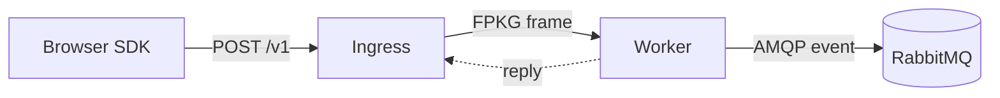

# Local quickstart

This guide gets the entire pipeline running on a single machine — a RabbitMQ
broker, a stateless Zig worker, and the HTTP ingress — and then sends a real
fingerprint package from the browser SDK. No cloud account, no native build.



## Prerequisites

- **Docker** and **Docker Compose v2** (`docker compose version`)
- **Node.js 18+** (to run the browser SDK inside a web app)
- A modern browser (Chromium, Firefox, or Safari) for the client side

## 1. Start the stack

The repository ships a ready-to-run `compose.yml` at its root. Clone it and bring
it up:

```bash
git clone https://github.com/Akshay2642005/fingerprint-engine
cd fingerprint-engine
docker compose up -d
```

This starts three services, wired together by Docker's built-in DNS:

| Service  | Image / build            | Inside network        | Published to host       |
| -------- | ------------------------ | --------------------- | ----------------------- |
| `rabbitmq` | `rabbitmq:4-management` | `rabbitmq:5672`     | `5672` (AMQP), `15672` (UI) |
| `worker`   | `deploy/Dockerfile.worker` | `worker:8080`     | (internal only)         |
| `ingress`  | `deploy/Dockerfile.ingress` | `ingress` (HTTP)  | `8080` (HTTP)           |

Verify everything is healthy:

```bash
docker compose ps
```

You should see `rabbitmq`, `worker`, and `ingress` all reporting a running state.
The worker waits for RabbitMQ's healthcheck before it boots, so the startup
order is correct out of the box.

## 2. Point the browser SDK at the ingress

With the stack up, the ingress is reachable on your machine at
`http://localhost:8080`. Tell the SDK where it lives (see
[Browser SDK](/docs/start/browser-sdk/) for the full contract):

```ts
import { configure, collect } from '@akshay2642005/fingerprint-sdk';

configure({ ingressUrl: 'http://localhost:8080/v1/fingerprints' });

const result = await collect();
console.log('package id :', result.packageId); // 16-byte replay identity
console.log('signals    :', result.signalCount); // how many of the 102 collected
console.log('sent       :', result.sent); // ingress accepted (HTTP 2xx)
console.log('reply      :', result.reply); // worker digest, when relayed
```

## 3. Collect your first package

`collect()` sweeps the 102 browser signals, serializes a versioned
SignalPackage v2 body, and POSTs it to the ingress. The browser performs **no
computation** — the canonical fingerprint is produced once, server-side, on the
worker.

When the ingress relays the worker's reply, `result.reply` carries the digest:

```ts
if (result.reply && result.reply.status === 0) {
  console.log('fingerprint :', result.reply.digestHex); // canonical SHA-256
}
```

## What just happened

1. The SDK POSTs the SignalPackage v2 body to the ingress at `/v1/fingerprints`.
2. The ingress wraps the request as an **FPKG frame** and sends it to
   `worker:8080` over TCP.
3. The worker verifies the frame, runs `engine.process()`, and computes the
   canonical SHA-256 digest.
4. The ingress relays the worker's reply (the `WorkerReply`) back to the browser.
5. In parallel, the worker publishes a result event to RabbitMQ on
   `rabbitmq:5672` (routing key `result.*` on the durable `fingerprint`
   exchange) for downstream consumers such as the fraud platform.

## Troubleshooting

| Symptom | Likely cause | Fix |
| ------- | ------------ | --- |
| `collect()` never resolves / network error | Ingress not yet up | `docker compose ps` — wait for `ingress` to be running, then retry. |
| `result.sent` is `false` | Wrong `ingressUrl` or ingress rejected the package | Confirm `ingressUrl` points at the published port (`http://localhost:8080/v1/fingerprints`). |
| Worker logs show it cannot reach RabbitMQ | Broker not ready at worker boot | The bundled `compose.yml` uses `condition: service_healthy`; restart the stack. |

## Next steps

- [Browser SDK](/docs/start/browser-sdk/) — configure, collect, and enforce fraud decisions.
- [Ingress](/docs/start/ingress/) — every flag and environment variable.
- [Worker](/docs/start/worker/) — transports, AMQP publishing, and running multiple workers.
- [Self-host](/docs/start/self-host/) — a full compose file with the ingress and **three** workers, ready to scale.
