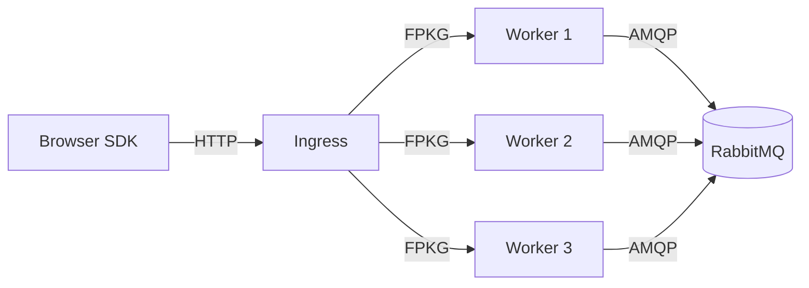

# Self-host

This page is the **full stack in one file**: a RabbitMQ broker, the HTTP ingress,
and **three** stateless workers. Copy it, run one command, and you have a
production-shaped deployment on a single host. It extends the single-worker
[Local quickstart](/docs/start/quickstart/) with horizontal worker scaling.



## The compose file

Save this as `compose.yml` next to the repository root (where `deploy/` lives),
then run `docker compose up -d`.

<span data-compose="Docker Compose"></span>

```yaml
services:
  rabbitmq:
    image: rabbitmq:4-management
    container_name: rabbitmq
    restart: always
    ports:
      - "5672:5672"      # AMQP protocol port
      - "15672:15672"    # HTTP management UI (optional)
    environment:
      - RABBITMQ_DEFAULT_USER=guest
      - RABBITMQ_DEFAULT_PASS=guest
      - RABBITMQ_DEFAULT_VHOST=/
    volumes:
      - rabbitmq_data:/var/lib/rabbitmq
    healthcheck:
      test: ["CMD", "rabbitmq-diagnostics", "-q", "ping"]
      interval: 10s
      timeout: 5s
      retries: 5

  worker1:
    build:
      context: .
      dockerfile: deploy/Dockerfile.worker
    container_name: worker1
    restart: always
    command:
      - "start"
      - "--transport=tcp"
      - "--listen=0.0.0.0:8080"
      - "--publish=amqp"
      - "--amqp-address=rabbitmq:5672"
      - "--amqp-user=guest"
      - "--amqp-password=guest"
      - "--amqp-vhost=/"
    environment:
      - FPKG_LOG_LEVEL=info
    depends_on:
      rabbitmq:
        condition: service_healthy

  worker2:
    build:
      context: .
      dockerfile: deploy/Dockerfile.worker
    container_name: worker2
    restart: always
    command:
      - "start"
      - "--transport=tcp"
      - "--listen=0.0.0.0:8080"
      - "--publish=amqp"
      - "--amqp-address=rabbitmq:5672"
      - "--amqp-user=guest"
      - "--amqp-password=guest"
      - "--amqp-vhost=/"
    environment:
      - FPKG_LOG_LEVEL=info
    depends_on:
      rabbitmq:
        condition: service_healthy

  worker3:
    build:
      context: .
      dockerfile: deploy/Dockerfile.worker
    container_name: worker3
    restart: always
    command:
      - "start"
      - "--transport=tcp"
      - "--listen=0.0.0.0:8080"
      - "--publish=amqp"
      - "--amqp-address=rabbitmq:5672"
      - "--amqp-user=guest"
      - "--amqp-password=guest"
      - "--amqp-vhost=/"
    environment:
      - FPKG_LOG_LEVEL=info
    depends_on:
      rabbitmq:
        condition: service_healthy

  ingress:
    build:
      context: .
      dockerfile: deploy/Dockerfile.ingress
    container_name: fingerprint-ingress
    restart: always
    ports:
      - "8080:8080"      # HTTP (browser SDK -> ingress)
    environment:
      - FPKG_LOG_LEVEL=info
      - FPKG_WORKERS=worker1:8080,worker2:8080,worker3:8080
    depends_on:
      - worker1
      - worker2
      - worker3

volumes:
  rabbitmq_data:
```


## What each service does

- **`rabbitmq`** — the AMQP 0-9-1 broker. Workers publish fingerprint result
  events here after computing a digest. The `healthcheck` (`rabbitmq-diagnostics
  ping`) lets the workers wait for the broker to be ready before they boot,
  avoiding a startup race.
- **`worker1` / `worker2` / `worker3`** — three identical stateless Zig
  containers. Each listens for FPKG frames on `:8080` (inside its own network
  namespace, so the port does not clash) and publishes results to RabbitMQ. They
  need **no host port mapping** — only the ingress reaches them, by name.
- **`ingress`** — the HTTP gateway. It is published on `8080` so the browser SDK
  can reach it. It discovers all three workers through the `FPKG_WORKERS`
  environment variable and load-balances frames across them.

## Why this works with zero hardcoded IPs

Docker Compose creates a private network and registers every service under its
**service name** as a hostname. So the ingress connects to `worker1:8080`,
`worker2:8080`, `worker3:8080`, and each worker connects to `rabbitmq:5672` — all
by name. Container IPs change on every restart; the names do not, so the wiring in
this file never drifts.

## Configuration reference

### Worker (`command` flags)

| Flag | Value used here | Meaning |
| ---- | --------------- | ------- |
| `--transport` | `tcp` | Accept FPKG frames over a TCP socket (requires `--listen`). |
| `--listen` | `0.0.0.0:8080` | Bind inside the container. Port `8080` is unique per container. |
| `--publish` | `amqp` | Publish each reply to RabbitMQ. |
| `--amqp-address` | `rabbitmq:5672` | Broker resolved by service name. |
| `--amqp-user` / `--amqp-password` | `guest` / `guest` | Dev defaults — **override in production.** |
| `--amqp-vhost` | `/` | Broker virtual host. |

### Ingress (environment)

| Variable | Value used here | Meaning |
| -------- | --------------- | ------- |
| `FPKG_WORKERS` | `worker1:8080,worker2:8080,worker3:8080` | Comma-separated worker pool seeds (equivalent to repeating `--worker`). |
| `FPKG_LOG_LEVEL` | `info` | `err` \| `warn` \| `info` \| `debug`. |

### RabbitMQ (environment)

| Variable | Value used here | Meaning |
| -------- | --------------- | ------- |
| `RABBITMQ_DEFAULT_USER` / `RABBITMQ_DEFAULT_PASS` | `guest` | Dev defaults — **override in production.** |
| `RABBITMQ_DEFAULT_VHOST` | `/` | Virtual host the workers publish into. |

## Run it

```bash
docker compose up -d
docker compose ps          # all five services should be running
docker compose logs -f ingress worker1
```

Point the browser SDK at the published ingress port:

```ts
configure({ ingressUrl: 'http://localhost:8080/v1/fingerprints' });
```

## Scaling

To add a fourth worker, copy the `worker3` block to a `worker4` with a unique
`container_name`, and append `worker4:8080` to the ingress `FPKG_WORKERS` list.
No other change is required — the engine's determinism means any worker can serve
any request.

## Next steps

- [Ingress](/docs/start/ingress/) — the full ingress flag and environment reference.
- [Worker](/docs/start/worker/) — transports, AMQP publishing, and running many workers.
- [Browser SDK](/docs/guides/browser-sdk/) — configure the client to talk to this ingress.
- [Guides: Docker Compose](/docs/guides/docker-compose/) — the single-worker variant and container-name DNS deep dive.
