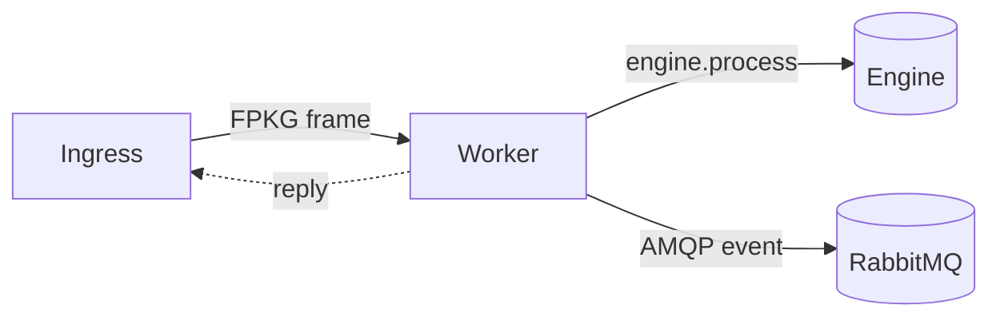

# Worker setup

The worker is the stateless, deterministic computation container of the Fingerprint
Engine. It receives **FPKG-framed** messages, runs `engine.process()`, relays a
reply, and optionally publishes result events over AMQP. It contains no
application business logic — every computation happens in the engine.



## Build and run

The worker ships as a standalone binary (`zig build worker`) and as the
`fingerprint worker` subcommand (`zig build fingerprint`). Both are equivalent.

```bash
# standalone
zig build worker --release=safe
./zig-out/bin/worker start --transport=tcp --listen=0.0.0.0:8080 --publish=amqp

# or combined
zig build fingerprint --release=safe
./zig-out/bin/fingerprint worker start --transport=tcp --listen=0.0.0.0:8080 --publish=amqp
```

The `deploy/Dockerfile.worker` image sets the entrypoint to `/usr/local/bin/worker`,
so in compose the `command` is just the flags.

## Flags

```
worker start --transport=loopback|tcp [--listen=host:port]
             [--publish=none|amqp]
             [--idle-timeout-ms=ms]
             [--amqp-address=host:port] [--amqp-user=user]
             [--amqp-password=pass] [--amqp-vhost=vhost]
worker version
worker help
```

| Flag | Default | Description |
| ---- | ------- | ----------- |
| `--transport` | `loopback` | `loopback` (stdin/stdout frames, for pipes/tests) or `tcp` (FPKG request/response server; requires `--listen`). |
| `--listen` | _(required for tcp)_ | `host:port` to bind for `--transport=tcp`. Port `0` picks an ephemeral port. |
| `--publish` | `none` | `none` or `amqp`. With `amqp`, every reply frame is published to the broker's durable `fingerprint` exchange under routing key `result.<message-type>`, with publisher confirms. |
| `--idle-timeout-ms` | `30000` | TCP client idle deadline in ms; `0` disables. A client that sends nothing for this long is disconnected so a stalled connection cannot wedge the accept loop. |
| `--amqp-address` | `127.0.0.1:5672` | Broker `host:port` for `--publish=amqp`. |
| `--amqp-user` | `guest` | Broker username. |
| `--amqp-password` | `guest` | Broker password. **Production deployments must override this.** |
| `--amqp-vhost` | `/` | Broker virtual host. |
| `--log-level` | `info` | `err` \| `warn` \| `info` \| `debug`. |
| `--log-format` | `text` | `text` \| `json`. |

## Environment variables

Flags win over environment variables, which win over defaults.

| Variable | Equivalent | Notes |
| -------- | ---------- | ----- |
| `FPKG_LOG_LEVEL` | `--log-level` | `err` \| `warn` \| `info` \| `debug`. |
| `FPKG_LOG_FORMAT` | `--log-format` | `text` \| `json`. |

The AMQP credentials are passed as flags (or hard-coded in a compose `command`).
`guest`/`guest` is the standard RabbitMQ development default — **never** ship that
to production; supply real credentials via `--amqp-user` / `--amqp-password`.

## A minimal local worker

```bash
./zig-out/bin/worker start \
  --transport=tcp \
  --listen=0.0.0.0:8080 \
  --publish=amqp \
  --amqp-address=rabbitmq:5672 \
  --amqp-user=guest \
  --amqp-password=guest \
  --amqp-vhost=/
```

This is exactly what the bundled `compose.yml` runs. The worker connects to
`rabbitmq:5672` by container name and publishes result events to the
`fingerprint` exchange.

## Running multiple workers

Workers are fully stateless: each holds no state between frames (an arena resets
after every request), and the engine is deterministic, so any worker produces the
identical digest for the identical package. That makes scaling a matter of running
more worker processes — no shared cache, no coordination, no leader election.

```bash
# three independent workers on different ports
for p in 8080 8081 8082; do
  ./zig-out/bin/worker start --transport=tcp --listen=0.0.0.0:$p --publish=amqp \
    --amqp-address=rabbitmq:5672 &
done

# the ingress then points at all three
./zig-out/bin/ingress start --listen=0.0.0.0:8080 \
  --worker=127.0.0.1:8080 --worker=127.0.0.1:8081 --worker=127.0.0.1:8082
```

In Docker, run N worker services (see [Self-host](./self-host.md)); the ingress
reaches each by its service name through `FPKG_WORKERS`. Because the computation
is invariant, the pool size is purely an infrastructure decision driven by
throughput and availability — never algorithmic.

## Next steps

- [Ingress](./ingress.md) — the HTTP front that feeds the worker pool.
- [Self-host](./self-host.md) — a full compose file with the ingress and three workers.
- [Guides: Worker CLI](../guides/worker-cli.md) — the complete flag reference and FPKG message-type mapping.
